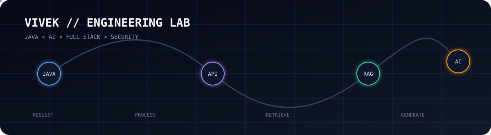

<div align="center">


# `VIVEK PK`
### `JAVA × AI × FULL STACK × SECURITY`
**Java Full Stack Developer • AI Application Builder • CSE (AI & ML)**

[GitHub](https://github.com/vivekpk) • LinkedIn
</div>

---

## `SYSTEM.INFO`

```text
┌─────────────────────────────────────────────────────────────┐
│ VIVEK ENGINEERING LAB                                      │
│ ROLE       → Java Full Stack Developer / AI Builder        │
│ EDUCATION  → B.Tech CSE (AI & ML)                          │
│ CGPA       → 8.54                                          │
│ FOCUS      → Full Stack • GenAI • RAG • Security           │
│ MODE       → BUILDING                                      │
└─────────────────────────────────────────────────────────────┘
```

## `LIVE.DATA.FLOW`


```text
USER → HTML/CSS/JAVASCRIPT → NODE.JS + EXPRESS.JS → REST API → MYSQL → RESPONSE
```

### `AI.DATA.FLOW`

`DOCUMENTS → CHUNKING → EMBEDDINGS → VECTOR DB → RETRIEVAL → LLM → GROUNDED ANSWER`

---

## `PROJECT.LAB`

| PROJECT | STACK | HIGHLIGHT |
|---|---|---|
| 🏫 Teacher Substitution & Timetable System | Node.js • Express • MySQL • JS | Automated timetable/substitution workflow + role-based portals |
| 🏨 Hotel Grand Palate | Node.js • Express • MySQL • JS | Reservation/contact APIs + LLM-powered Ask AI chatbot |
| 🏦 Banking Management System | Core Java • Swing • JDBC • MySQL | Secure login, transactions, transfers and persistent storage |

## `AI.LAB`

`GENAI` `LLMs` `PROMPT ENGINEERING` `RAG` `AI CHATBOTS`

```text
PROMPT → LLM
          ↑
DOCUMENTS → RETRIEVE → GROUNDED ANSWER
```

## `SECURITY.MODULE`

`AUTHENTICATION → AUTHORIZATION → RBAC → SERVER VALIDATION → SESSION MANAGEMENT → TRANSACTION INTEGRITY`

## `TECH.STACK`

**Java** `Java` `JavaScript ES6` `SQL` `HTML5` `CSS3`

**Backend** `Node.js` `Express.js` `REST APIs` `JDBC`

**Database** `MySQL` `CRUD` `Joins` `Schema Design`

**AI** `GenAI` `LLMs` `Prompt Engineering` `RAG`

**Tools** `Git` `GitHub` `VS Code` `NetBeans` `MySQL Workbench`

**AI-assisted development** `GitHub Copilot` `ChatGPT` `Claude` `Cursor`

## `RESEARCH.LAB`

📄 **Echoes of Instinct: Decoding Behaviour Using Deep Learning** — IEEE Xplore

📄 **Assessment of Ridge Regression-Based Machine Learning Model for Prediction of Automotive Sales Based on the Customer Requirements** — Springer Nature

💡 **Patent filed:** Sustainable Alternative to Naphthalene Balls

## `BUILD.STATUS`

```text
[████████████████████░░] 90%
> BUILD
> LEARN
> EXPERIMENT
> SHIP
```

### Currently focusing on
- AI-powered full-stack applications
- RAG application architecture
- Secure REST APIs
- Java + JavaScript backend development
- Stronger open-source projects

## `GITHUB.ACTIVITY`

<div align="center">


</div>

---

<div align="center">

### `BUILD → LEARN → INNOVATE`

**Thanks for visiting my engineering lab.**

</div>
